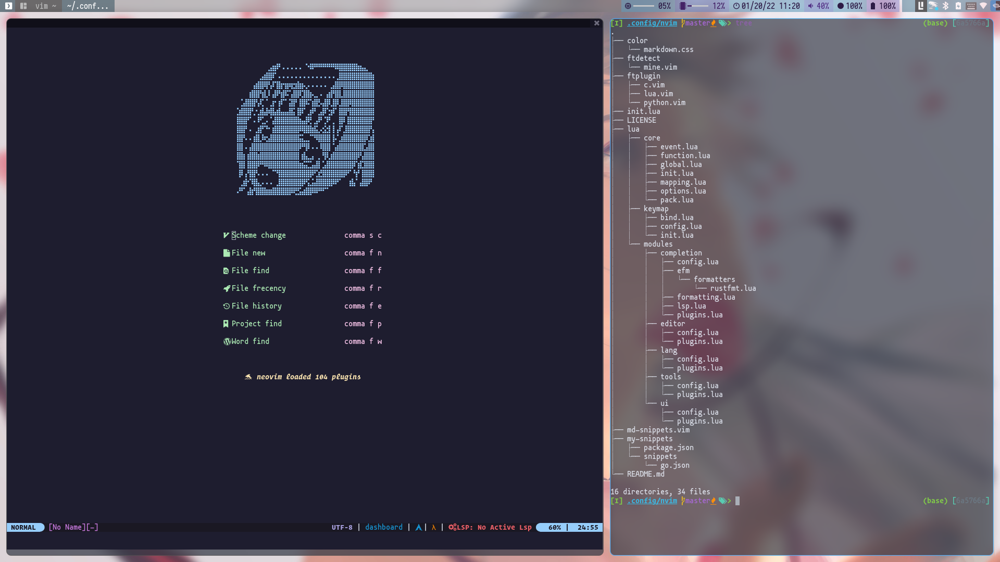
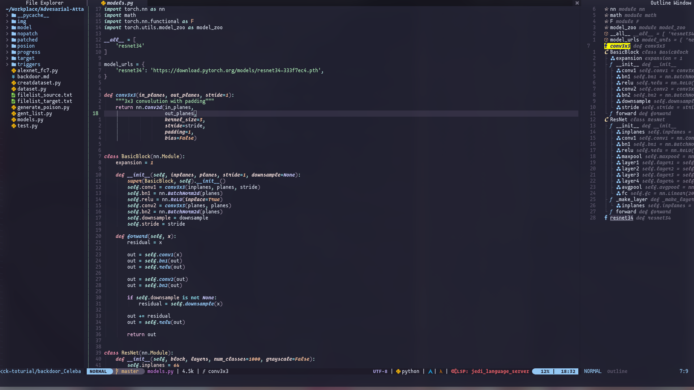
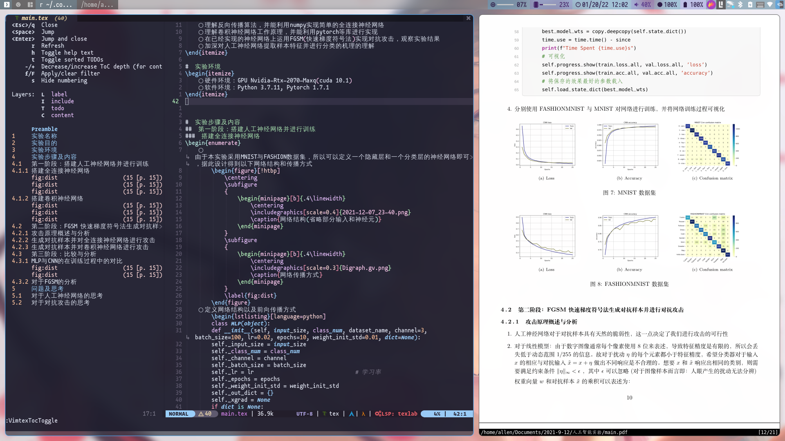
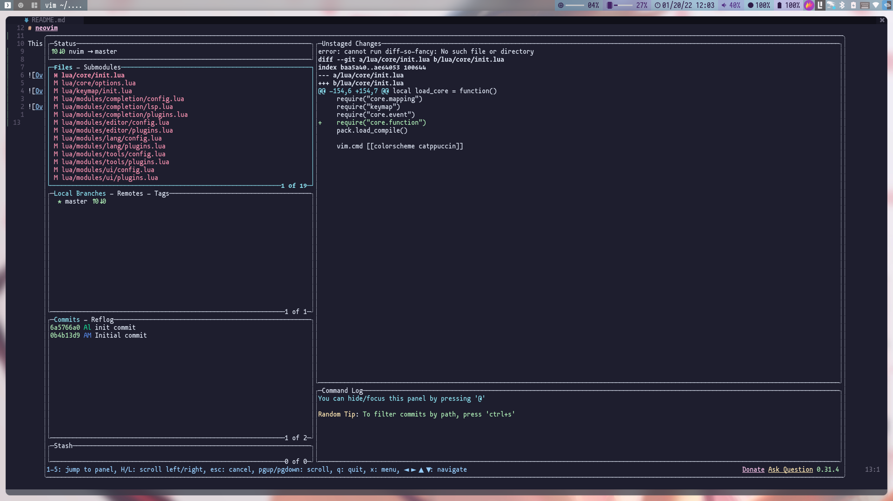
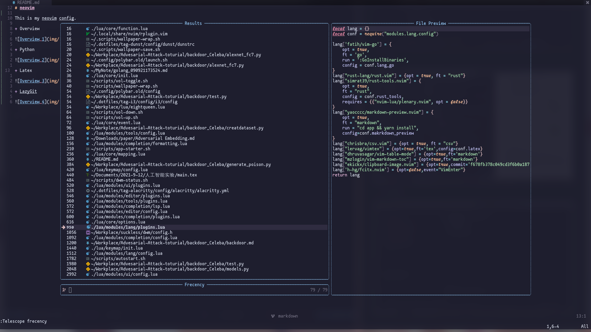
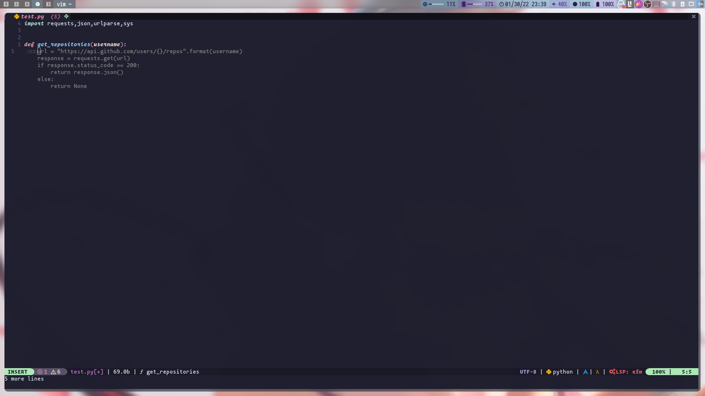
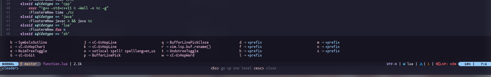
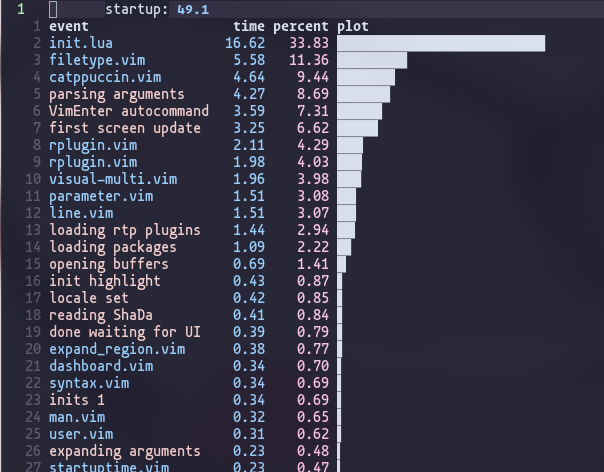

<!-- markdownlint-disable MD033 MD041 -->
<p align="center">
  <a href="https://github.com/Allen191819/neovim"></a>
</p>

<div align="center">

# Neovim

<!-- prettier-ignore-start -->
<!-- markdownlint-disable-next-line MD036 -->
_✨ neovim lua config ✨_
<!-- prettier-ignore-end -->

</div>

## Toc

<!-- vim-markdown-toc GFM -->

* [Overview](#overview)
* [配置文件结构](#配置文件结构)
* [Key mapping](#key-mapping)
    * [nvim 快捷键重写](#nvim-快捷键重写)
    * [插件快捷键](#插件快捷键)
* [Lazy load](#lazy-load)

<!-- vim-markdown-toc -->

## Overview

- Dashboard



- Python



- Latex



- LazyGit



- Telescope



- Copilot



## 配置文件结构

- Overview

```
nvim
├── color
│   └── markdown.css
├── ftdetect
│   └── mine.vim
├── ftplugin
│   ├── c.vim
│   ├── lua.vim
│   └── python.vim
├── img
│   ├── 2022-01-20-11-20-53.png
│   ├── 2022-01-20-11-57-25.png
│   ├── 2022-01-20-12-02-36.png
│   ├── 2022-01-20-12-03-53.png
│   └── 2022-01-20-12-14-17.png
├── init.lua
├── LICENSE
├── lua
│   ├── core
│   │   ├── event.lua
│   │   ├── function.lua
│   │   ├── global.lua
│   │   ├── init.lua
│   │   ├── mapping.lua
│   │   ├── options.lua
│   │   └── pack.lua
│   ├── keymap
│   │   ├── bind.lua
│   │   ├── config.lua
│   │   └── init.lua
│   └── modules
│       ├── completion
│       │   ├── config.lua
│       │   ├── efm
│       │   │   └── formatters
│       │   │       └── rustfmt.lua
│       │   ├── formatting.lua
│       │   ├── lsp.lua
│       │   └── plugins.lua
│       ├── editor
│       │   ├── config.lua
│       │   └── plugins.lua
│       ├── lang
│       │   ├── config.lua
│       │   └── plugins.lua
│       ├── tools
│       │   ├── config.lua
│       │   └── plugins.lua
│       └── ui
│           ├── config.lua
│           └── plugins.lua
├── md-snippets.vim
├── my-snippets
│   ├── package.json
│   └── snippets
│       └── go.json
└── README.md
```

- lua 文件夹

| `file`               | `function`                                                     |
| -------------------- | -------------------------------------------------------------- |
| `core`               | function、options、packer 配置、部分 nvim 键位的重写、autocmds |
| `keymap`             | 插件快捷键                                                     |
| `modules/completion` | nvim 的补全配置以及 lsp 相关配置                               |
| `modules/editor`     | nvim 编辑器工具配置                                            |
| `modules/lang`       | 对特定语言的插件配置                                           |
| `modules/tools`      | 实用工具配置                                                   |
| `modules/ui`         | nvim 的 ui 配置                                                |

## Key mapping

本配置中 `<leader>` 为 `<Space>`

### nvim 快捷键重写

| `mode` | `keymapping` | `cmd or keymaping`                     | `function`           |
| ------ | ------------ | -------------------------------------- | -------------------- |
| `n`    | `<C-s>`      | `:write<Cr>`                           | Save file            |
| `n`    | `W`          | `:Autoformat<Cr>:w<Cr>`                | Save file and format |
| `n`    | `<C-j>`      | `<C-w>j`                               | 光标移到上方窗口     |
| `n`    | `<C-k>`      | `<C-w>k`                               | 光标移到下方窗口     |
| `n`    | `<C-h>`      | `<C-w>h`                               | 光标移到左侧窗口     |
| `n`    | `<C-l>`      | `<C-w>l`                               | 光标移到右侧窗口     |
| `n`    | `<A-[`       | `:vertical resize -5<Cr>`              | resize 当前窗口      |
| `n`    | `<A-]`       | `:vertical resize +5<Cr>`              | resize 当前窗口      |
| `n`    | `<A-;`       | `:resize -2<Cr>`                       | resize 当前窗口      |
| `n`    | `<A-'`       | `:resize +2<Cr>`                       | resize 当前窗口      |
| `n`    | `<leader>o`  | `:setlocal spell! spelllang=en_us<Cr>` | 打开 spell check     |
| `n`    | `<leader>h`  | `:set hlsearch!<Cr>`                   | 关闭/打开搜索高亮    |
| `n/i`  | `<C-q>`      | `<Esc>/<CR>:nohlsearch<CR>\"_c4l`      | 搜索锚点             |
| `n`    | `RR`         | `:call CompileRunGccH()<CR>`           | 运行代码             |
| `n`    | `Rf`         | `:call CompileRunGccF()<CR>`           | 运行代码(floaterm)   |

### 插件快捷键

- Copilot

| `mode` | `keymapping` | `cmd or keymaping`        | `function`                 |
| ------ | ------------ | ------------------------- | -------------------------- |
| `i`    | `<A-h>`      | `copilot#Accept("\<CR>")` | 选择 Copilot 的 suggestion |
| `i`    | `<A-j>`      | `copilot#NextResult(1)`   | 滚动 Copilot 的 suggestion |
| `i`    | `<A-k>`      | `copilot#NextResult(-1)`  | 滚动 Copilot 的 suggestion |
| `i`    | `<C-]>`      | `copilot#Dismiss()`       | 关闭 Copilot 的 suggestion |

- BufferLine

| `mode` | `keymapping` | `cmd or keymaping`            | `function`                |
| ------ | ------------ | ----------------------------- | ------------------------- |
| `n`    | `<leader>p`  | `BufferLinePick`              | 选择一个 Buffer           |
| `n`    | `<leader>q`  | `BufferLinePickClose`         | 选择一个 Buffer 并关闭    |
| `n`    | `<A-number>` | `BufferLineGoToBuffer number` | 跳转到第 number 个 Buffer |

- Packer

| `mode` | `keymapping` | `cmd or keymaping` | `function`         |
| ------ | ------------ | ------------------ | ------------------ |
| `n`    | `<leader>ps` | `PackerSync`       | Update and Compile |
| `n`    | `<leader>pu` | `PackerUpdate`     | Update Plugins     |
| `n`    | `<leader>pi` | `PackerInstall`    | Install Plugins    |
| `n`    | `<leader>pc` | `PackerClean`      | Clean Plugins      |

- lsp

| `mode` | `keymapping` | `cmd or keymaping`                        | `function`         |
| ------ | ------------ | ----------------------------------------- | ------------------ |
| `n`    | `<leader>li` | `LspInfo`                                 | Lsp 信息           |
| `n`    | `<leader>lr` | `LspRestart`                              | 重启 Lsp           |
| `n`    | `g[`         | `<cmd>lua vim.diagnostic.goto_next()<CR>` | 跳转到上一个错误   |
| `n`    | `g]`         | `<cmd>lua vim.diagnostic.goto_perv()<CR>` | 跳转到下一个错误   |
| `n`    | `<leader>r`  | `<cmd>lua vim.lsp.buf.rename()<CR>`       | 重命名             |
| `n`    | `K`          | `<cmd>lua vim.lsp.buf.hover()<CR>`        | 查看文档           |
| `n`    | `<leader>ca` | `:Telescope lsp_code_actions<CR>`         | codeaction         |
| `v`    | `<leader>ca` | `:Telescope lsp_ranger_code_actions<CR>`  | codeaction         |
| `n`    | `gd`         | `lua vim.lsp.buf.definition()`            | 跳转到定义处       |
| `n`    | `gr`         | `lua vim.lsp.buf.references()`            | 跳转到引用处       |
| `n`    | `gh`         | `lua vim.lsp.buf.signature_help()`        | 查看 function 参数 |

- Git

| `mode` | `keymapping` | `cmd or keymaping` | `function` |
| ------ | ------------ | ------------------ | ---------- |
| `n`    | `<leader>G`  | `Git`              | 打开 git   |
| `n`    | `gps`        | `G push`           | git push   |
| `n`    | `gpl`        | `G pull`           | git pull   |

- Trouble

| `mode` | `keymapping` | `cmd or keymaping`                        | `function`                   |
| ------ | ------------ | ----------------------------------------- | ---------------------------- |
| `n`    | `gt`         | `TroubleToggle`                           | Toggle Trouble               |
| `n`    | `gR`         | `TroubleToggle lsp_references`            | Trouble lsp references       |
| `n`    | `<leader>cd` | `TroubleToggle lsp_document_diagnostics`  | Trouble document diagnostics |
| `n`    | `<leader>cw` | `TroubleToggle lsp_workspace_diagnostics` | Trouble workspace diagnostic |
| `n`    | `<leader>cq` | `Trouble quickfix`                        | Trouble quickfix             |
| `n`    | `<leader>cl` | `Trouble loclist`                         | Trouble loclist              |

- Some tree

| `mode` | `keymapping` | `cmd or keymaping` | `function`     |
| ------ | ------------ | ------------------ | -------------- |
| `n`    | `<leader>e`  | `NvimtreeToggle`   | 打开文件树     |
| `n`    | `<leader>nf` | `NvimtreeFindFile` | 查找文件       |
| `n`    | `<leader>nr` | `NvimTreeRefresh`  | 刷新文件树     |
| `n`    | `<leader>t`  | `UndotreeToggle`   | 开始 undotree  |
| `n`    | `<leader>b`  | `SymbolsOutline`   | Toggle outline |

- Telescope

| `mode` | `keymapping` | `cmd or keymaping`                                        | `function`                     |
| ------ | ------------ | --------------------------------------------------------- | ------------------------------ |
| `n`    | `<leader>fp` | `lua require('telescope').extensions.project.project{}`   | Telescope 查找 Project         |
| `n`    | `<leader>fr` | `lua require('telescope').extensions.frecency.frecency{}` | Telescope 查找最近操作的文件   |
| `n`    | `<leader>fe` | `DashboardFindHistory`                                    | Telescope 查找最近操作的文件   |
| `n`    | `<leader>ff` | `DashboardFindFile`                                       | Telescope 查找文件             |
| `n`    | `<leader>sc` | `DashboardChangeColorscheme`                              | Telescope 查找 nvim 主题       |
| `n`    | `<leader>fw` | `DashboardFindWord`                                       | Telescope 查找单词             |
| `n`    | `<leader>fn` | `DashboardNewFile`                                        | 创建新文件                     |
| `n`    | `<leader>fb` | `Telescope file_browser`                                  | Telescope 文件浏览器           |
| `n`    | `<leader>fg` | `Telescope git_files`                                     | Telescope 查找 git 文件        |
| `n`    | `<leader>fz` | `Telescope zoxide list`                                   | Telescope zoxide list          |
| `n`    | `<leader>fs` | `Telescope symbols`                                       | Telescope symbols              |
| `n`    | `<leader>fu` | `Telescope current_buffer_fuzzy_find`                     | Telescope 当前 buffer 模糊查找 |

- Hop

| `mode` | `keymapping` | `cmd or keymaping` | `function`       |
| ------ | ------------ | ------------------ | ---------------- |
| `n`    | `<leader>w`  | `HopWord`          | 快速跳转(word)   |
| `n`    | `<leader>j`  | `HopLine`          | 快速跳转(line)   |
| `n`    | `<leader>k`  | `HopLine`          | 快速跳转(line)   |
| `n`    | `<leader>c`  | `HopChar1`         | 快速跳转(char 1) |
| `n`    | `<leader>cc` | `HopChar2`         | 快速跳转(char 2) |

- Term

| `mode` | `keymapping` | `cmd or keymaping`                          | `function`    |
| ------ | ------------ | ------------------------------------------- | ------------- |
| `n`    | `<C-\>`      | `VTerm`                                     | 打开侧边 Trem |
| `n`    | `<F12>`      | `FloatermNew`                               | 打开浮动 Term |
| `n`    | `<leader>th` | `FloatermNew --wintype=split --height=0.40` | 打开下侧 Term |
| `n`    | `<leader>tv` | `FloatermNew --wintype=vsplit --width=0.40` | 打开侧边 Term |

- Run code

| `mode` | `keymapping` | `cmd or keymaping` | `function`   |
| ------ | ------------ | ------------------ | ------------ |
| `n`    | `<A-e>`      | `QuickRun`         | 快速运行代码 |
| `v`    | `<A-r>`      | `SnipRun`          | 运行代码片段 |
| `n`    | `<A-c>`      | `SnipClose`        | 关闭 Sniprun |

- Markdown

| `mode` | `keymapping` | `cmd or keymaping` | `function`          |
| ------ | ------------ | ------------------ | ------------------- |
| `n`    | `<leader>mi` | `PasteImg`         | 插入图片            |
| `n`    | `<leader>mt` | `TableModeToggle`  | Markdown table 模式 |

- Some others

| `mode` | `keymapping` | `cmd or keymaping`           | `function`                 |
| ------ | ------------ | ---------------------------- | -------------------------- |
| `v`    | `v`          | `vim-expand-region-expand`   | 快捷选中                   |
| `v`    | `V`          | `vim-expand-region-shrink`   | 快捷选中(减小区域)         |
| `n`    | `ga`         | `v:lua.enhance_align('nga')` | 代码整理对齐               |
| `x`    | `ga`         | `v:lua.enhance_align('xga')` | 代码整理对齐               |
| `n`    | `gs`         | `Switch`                     | 快捷切换(`false`<->`true`) |

- vim-surround

It's easiest to explain with examples. Press `cs"'` inside

    "Hello world!"

to change it to

    'Hello world!'

Now press `cs'<q>` to change it to

    <q>Hello world!</q>

To go full circle, press `cst"` to get

    "Hello world!"

To remove the delimiters entirely, press `ds"`.

    Hello world!

Now with the cursor on "Hello", press `ysiw]` (`iw` is a text object).

    [Hello] world!

Let's make that braces and add some space (use `}` instead of `{` for no
space): `cs]{`

    { Hello } world!

Now wrap the entire line in parentheses with `yssb` or `yss)`.

    ({ Hello } world!)

Revert to the original text: `ds{ds)`

    Hello world!

Emphasize hello: `ysiw<em>`

    <em>Hello</em> world!

Finally, let's try out visual mode. Press a capital V (for linewise
visual mode) followed by `S<p class="important">`.

    <p class="important">
      <em>Hello</em> world!
    </p>

由于安装了 `Whichkey` 插件，当按下 `,` 后可以启动 `Whichkey` ,此时按下`<leader>`nvim 会给出相应的提示。



## Lazy load

由于`packer.nvim`的 lazy load 特性，本 nvim 配置启动速度在 50ms 以下：


